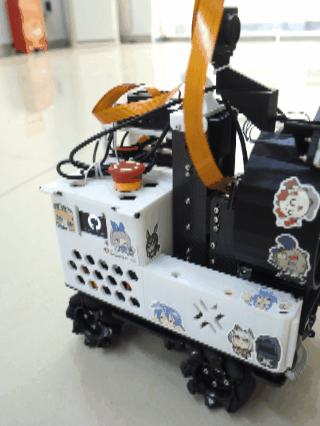
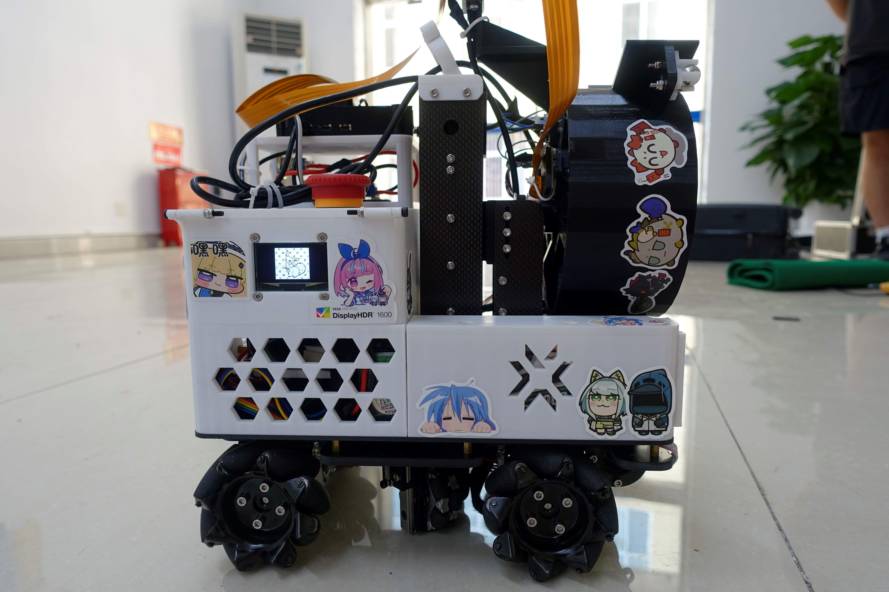
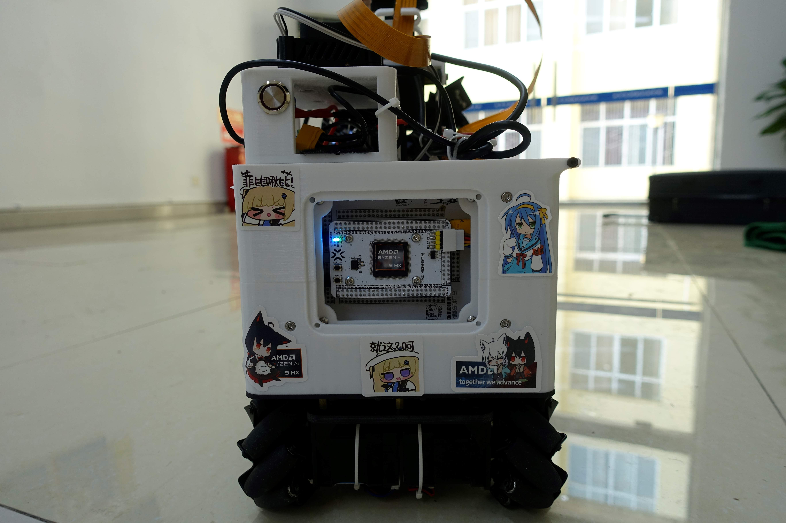
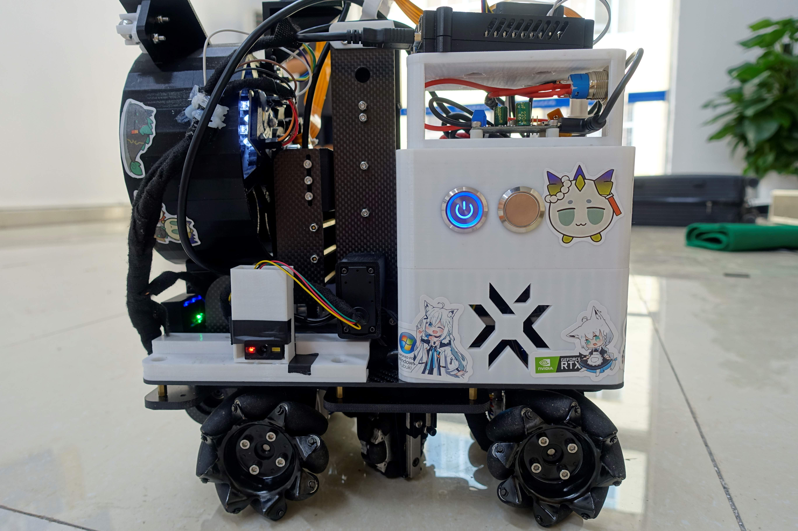
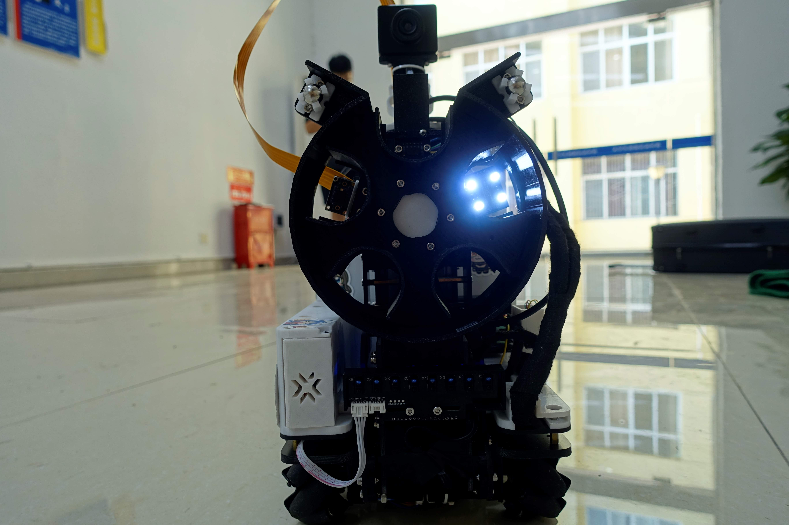

# 乐山机恶霸 · 2026 RoboCup 物流小车

> 成都理工大学工程技术学院 · 核聚Robot俱乐部
> 2026 RoboCup 物流小车竞赛项目存档 · 队伍：乐山机恶霸

本仓库为本队伍参加 2026 RoboCup 物流小车竞赛的完整项目存档，包含嵌入式控制源码（STM32）、机械结构模型与视觉代码，供后续队员及校内外参赛队伍参考学习。

## 项目展示







## 项目概览

项目整体分为**电控（STM32）**、**视觉（树莓派）**、**机械**三方面：

| 方向 | 说明                                        | 代码/资源位置                                       |
| :- | :---------------------------------------- | :-------------------------------------------- |
| 电控 | STM32F407ZGTx 主控，负责底盘运动、导航、机械臂/转盘控制与传感器采集 | `Core/`、`Drivers/`、`Applications/`、`MDK-ARM/` |
| 视觉 | 树莓派 + Python/OpenCV，负责颜色与目标识别，通过串口与主控通信   | `vision/`                                     |
| 机械 | 小车机械结构设计模型                                | `models/`                                     |

### 目录结构

```
LogCar_Code/
├── Core/            # STM32 底层配置（HAL、FreeRTOS、中断、时钟等）
├── Drivers/         # HAL 驱动库及自研外设驱动（User 目录）
├── Applications/    # 应用层模块（任务、底盘、导航、机械臂、转盘、显示、Shell）
├── Middlewares/     # 第三方中间件（FreeRTOS）
├── MDK-ARM/         # Keil MDK 工程文件
├── models/          # 机械结构模型压缩包（models.zip）
├── media/           # 项目展示照片与动图
├── vision/          # 树莓派端视觉代码（Python + OpenCV）
├── PINOUT.md        # 引脚与串口配置说明
└── LogCar_Code.ioc  # STM32CubeMX 工程文件
```

## 电控（STM32）

### 硬件架构

| 部件   | 说明                        | 通信方式                           |
| :--- | :------------------------ | :----------------------------- |
| 核心板  | STM32F407ZGT6 主控 [立创开源硬件](https://oshwhub.com/mikecrond/project_yaxznexk) | —     |
| 底盘   | 麦克纳姆轮 × 4，全向移动            | ZDT-X42S 闭环步进电机，USART6（921600） |
| 机械臂  | 舵机驱动                      | USART3（115200）                 |
| 转盘   | 奖杯/物料转运机构                 | —                              |
| 定位   | OPS 平面定位模块                | UART4（115200）                  |
| 扫码   | 二维码识别模块                   | UART5（115200）                  |
| 颜色识别 | TCS230 颜色传感器              | TIM4 输入捕获                      |
| 测距   | VL53L0X ToF（ST 官方驱动）      | I2C2                           |
| 追踪   | 追踪传感器                     | I2C1                           |
| 电源监测 | 电池电压检测                    | ADC1 通道 2                      |
| 显示   | OLED（SSD1306）             | SPI1                           |

详细引脚定义见 [PINOUT.md](PINOUT.md)。

### 软件架构

固件基于 STM32 HAL + FreeRTOS 开发，应用层按功能模块化组织：

```
Applications/
├── LogCar_mission/   # 总任务调度（物料导航、奖杯放置、转盘转运）
├── chassis/          # 底盘控制（麦克纳姆轮运动学、运动控制）
├── nav/              # 导航（地图定位/巡线、轨迹规划、路径跟踪、PID 控制）
├── arm/              # 机械臂控制
├── turntable/        # 转盘控制
├── Display/          # OLED 显示（图片、GIF 动画）
├── letter_shell/     # 串口命令行 Shell（含 2048、贪吃蛇等彩蛋）
└── ANSI_Art/         # ASCII 艺术显示

Drivers/User/         # 自研外设驱动
├── ADC/              # 电池电压检测
├── OLED/             # SSD1306 显示驱动
├── OPS/              # 平面定位模块
├── SCANNER/          # 二维码扫码模块
├── SENSOR/           # TCS230 颜色传感器 + 树莓派通信
├── SERVO/            # 舵机控制
├── STEP/             # ZDT-V5 闭环步进电机驱动
├── TRACK/            # 追踪传感器
└── VL53L0X/          # ToF 测距传感器（ST 官方 VL53L0X API 驱动）
```

> VL53L0X 驱动基于 ST 官方 VL53L0X API 库（[STSW-IMG005](https://www.st.com/en/embedded-software/stsw-img005.html)），`vl53l0x_port.c` 为队内自研移植层。

任务支持两种导航方式（地图定位 / 巡线）与两种颜色识别方式（颜色传感器 / 树莓派视觉），可通过 [mission.h](Applications/LogCar_mission/mission.h) 中的宏配置切换。

#### 第三方子模块

| 子模块                                               | 说明                                                     | 来源                                                                |
| :------------------------------------------------ | :----------------------------------------------------- | :---------------------------------------------------------------- |
| [zdt-v5-driver](Drivers/User/STEP/zdt-v5-driver/) | 张大头 V5 系列步进电机通用驱动库（串口版），支持 X42/X42S/Y42 全系列，GPL-3.0 协议 | [Pcb-yun/zdt-v5-driver](https://github.com/Pcb-yun/zdt-v5-driver) |

克隆仓库后需执行以下命令拉取子模块：

```bash
git submodule update --init --recursive
```

### 开发环境

本项目使用 VS Code + EIDE（Embedded IDE）插件进行编译、烧录与调试。仓库内自带 EIDE 工程配置（`.eide/` 目录），可无缝衔接：

1. 安装 [VS Code](https://code.visualstudio.com/) 及 [EIDE 插件](https://marketplace.visualstudio.com/items?itemName=CL.eide)
2. 用 VS Code 打开本仓库，通过 EIDE 加载 `.eide/eide.yml` 工程（或直接打开 `LogCar_Code.code-workspace`）
3. 选择目标芯片（STM32F407ZGTx）与调试器后，即可一键编译、烧录、调试

> 仓库同时保留 Keil MDK 工程（`MDK-ARM/LogCar_Code.uvprojx`），可按需选用。

## 视觉（树莓派）

树莓派端视觉代码位于 `vision/`，使用 Python + OpenCV 编写，基于 Picamera2 采集 CSI 摄像头画面。

- 与主控通信：树莓派串口 `/dev/ttyAMA0`（115200）连接主控 USART2，接收任务点指令并回传识别结果（帧格式见 `Drivers/User/SENSOR/rpi_sensor_port.c`）
- 运行环境：树莓派 + conda，依赖 `opencv-python`、`numpy`、`pyserial`、`picamera2`

| 文件                                              | 功能                              |
| :---------------------------------------------- | :------------------------------ |
| `main.py`                                       | 主程序：多线程采集画面、串口指令处理、识别调度         |
| `yanse.py`                                      | 颜色识别（HSV 阈值，红/绿/蓝/白/黑）          |
| `yuanhuan.py` / `yuanhuan1.py` / `yuanhuan2.py` | 圆环目标识别（轮廓检测 + 卡尔曼滤波稳定坐标，像素转 mm） |
| `csi.py`                                        | HSV 颜色阈值调试工具（滑动条实时调参）           |
| `csijiaozhun.py`                                | 摄像头白平衡校准工具                      |

## 机械

`models/models.zip` 为小车机械结构设计模型压缩包，可使用 SolidWorks 等软件打开查看。

## 致谢

本项目使用了以下开源项目，在此向各位作者表示诚挚的感谢：

| 开源项目                                                         | 用途                                                           | 作者                    | 许可证     |
| :----------------------------------------------------------- | :----------------------------------------------------------- | :-------------------- | :------ |
| [letter-shell](https://github.com/NevermindZZT/letter-shell) | 嵌入式命令行 Shell（`Applications/letter_shell/`）                   | NevermindZZT          | MIT     |
| [stm32-ssd1306](https://github.com/afiskon/stm32-ssd1306)    | OLED 显示驱动（`Drivers/User/OLED/ssd1306/`）                      | afiskon               | MIT     |
| [ascii-patrol](https://github.com/msokalski/ascii-patrol)    | 月球车 ASCII 游戏（`Applications/letter_shell/game/ASCII_Patrol/`） | msokalski             | GPL-3.0 |
| [SnakeTiny](https://github.com/K-Hanling/SnakeTiny)          | 贪吃蛇小游戏（`Applications/letter_shell/game/snake/`）              | Hanling               | MIT     |
| [2048.c](https://github.com/mevdschee/2048.c)                | 2048 小游戏（`Applications/letter_shell/game/2048/`）             | Maurits van der Schee | MIT     |

## 开发者

| 开发者                | 方向/角色               | 联系方式                                                                     |
| :----------------- | :------------------ | :----------------------------------------------------------------------- |
| Pcb-yun            | 电控 · 程序主体框架 / 电机驱动  | <pcbyinyun@163.com> · [GitHub](https://github.com/Pcb-yun)               |
| MIKECROND          | 电控 · 导航 / 任务 / 升降转盘；硬件 · 核心板绘制 / 焊接 | <3025780005@qq.com> · [GitHub](https://github.com/MIKECROND)             |
| hhhhhhywbx-netizen | 视觉 · 视觉开发           | <hhhhhhywbx@gmail.com> · [GitHub](https://github.com/hhhhhhywbx-netizen) |
| 欣投柚哈树              | 机械 · 机械设计           | <2450362413@qq.com>                                                      |

## 说明

本仓库部分代码使用 AI 辅助编写。

## 许可证

本项目使用 [GPL-3.0](LICENSE) 开源协议，详见仓库根目录 LICENSE 文件。

包含的第三方组件协议：

| 组件                 | 协议      |
| :----------------- | :------ |
| zdt-v5-driver（子模块） | GPL-3.0 |
| FreeRTOS           | MIT     |
| letter-shell       | MIT     |
| stm32-ssd1306      | MIT     |
| ascii-patrol       | GPL-3.0 |
| SnakeTiny          | MIT     |
| 2048.c             | MIT     |
